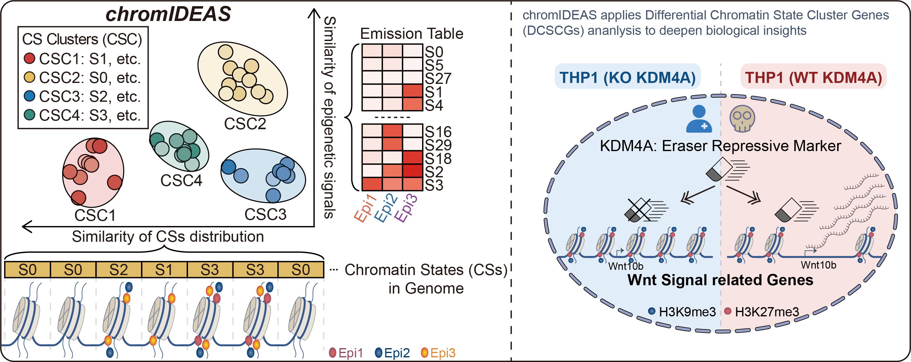

# **chromIDEAS Reveals Epigenetic Dynamics via Multi-Dimensional Clustering of Chromatin States**
**:writing_hand:Author**: Liu Yang

**:email:Email**: yangliu326459@gmail.com

Copyright (c) 2025 YenLab@SKLEH. All rights reserved.

## Introduction

The eukaryotic genome is packaged into chromatin, whose functional states are dynamically regulated through epigenetic modifications. These modifications play a central role in gene expression regulation, with their functional significance often intrinsically tied to their genomic distribution. Such spatial specificity is not merely coincidental; rather, it arises from the recruitment of transcription factors and epigenetic enzymes to specific genomic loci to execute context-dependent functions. For instance, transcriptional initiation at transcription start site (TSS) involves RNA polymerase II (Pol II) recruitment accompanied by specific histone marks such as H3K4me3 and H3K27ac, whereas transcriptional elongation through gene bodies is marked by H3K36me3 deposition. These distinct patterns reflect specialized regulatory roles of gene regulation, underscoring the critical importance of genomic context in interpreting epigenetic regulation.

Given the critical role of epigenetic regulation in cancer, traditional approaches in cancer research often begin by identifying differentially expressed genes (DEGs) and subsequently correlating these changes with individual epigenetic signals. However, epigenetic regulation operates as a highly complex and interconnected network, rendering isolated analyses of individual marks insufficient for elucidating disease-driving mechanisms. This limitation is particularly evident in malignancies like leukemia, where dysregulation typically involves combinatorial patterns across the epigenome rather than isolated modifications. Chromatin states (CSs), defined by recurrent co-occurrence patterns of epigenetic signals, offer a more holistic insight to address this challenge. Derived from hidden Markov models (HMMs), CSs are more robust than individual marks in identifying regulatory regions potentially responsible for oncogene dysregulation, with lower false-positive rates. Furthermore, genome-wide CS segmentation maps for large-scale reference epigenomes have been well established, providing a solid foundation for in-depth exploration of CSs.

Despite their utility, current CS analyses suffer from three major limitations that obscure their biological interpretation. First, functional annotation of CSs predominantly relies on their epigenetic signal composition while largely neglecting genomic distribution patterns, despite the established importance of genomic context in determining epigenetic function. Second, the excessive diversity of CSs complicates interpretation as existing methods fail to distinguish between functionally similar CSs that may represent subtle but biologically critical regulatory variants. Third, the requirement for multiple high-quality epigenomic datasets makes biological replicates technically challenging, thereby increasing false discovery rates and rendering existing analysis tools that typically require abundant replicates inapplicable.

Recent advances in single-cell genomics present clustering as a compelling solution to these limitations. By grouping cells with similar transcriptomes into functionally coherent populations, clustering enhances the resolution of inter-population differences while reducing intra-population noise. We extended this framework to CSs, based on the close relationship between CS function and both its epigenetic compositions and genomic distributions. Specifically, we hypothesized that CSs sharing these molecular features would exhibit coherent functional properties. This principle prompted the development of chromIDEAS (Chromatin Informative Dynamic Epigenomic Annotation Suite), a computational framework that classifies CSs into functionally coherent clusters by integrating multi-dimensional features.

To demonstrate the utility of chromIDEAS, we applied it to normal CD34+ cells and THP1 leukemia cells harboring the MLL-AF9 fusion oncoprotein. chromIDEAS independently identified five conserved chromatin state clusters (CSCs) in both cell types, capturing key transcriptional states (active and repressive) and genomic compartments (promoters, gene bodies, and transcription end sites, TES). Strikingly, chromIDEAS revealed that KDM4A-mediated erasure of repressive marks (H3K9me3/H3K27me3) at specific loci activates Wnt signaling to drive leukemogenesis This establishes a novel dimension of KDM4A's leukemogenic activity. More broadly, this work provides a framework for advancing beyond static chromatin state annotations toward dynamic, functionally informed representations of the epigenome—an essential step toward deciphering how chromatin patterning goes awry in disease.

## :file_folder:Scripts organization

All scripts and key raw data here can reproduce the paper.

- To generate the chromatin state segmentation, you can use our chromIDEAS implementation, which has been released on the conda platform. For details, please refer to https://github.com/fatyang799/chromIDEAS or https://chromideas.readthedocs.io/en/latest
- Raw chromatin state segmentation data from the study is available at:🔗 https://doi.org/10.6084/m9.figshare.29557994.v1; For interactive visualization, the data can be explored using the UCSC Genome Browser:🔗 https://genome.ucsc.edu/cgi-bin/hgTracks?db=hg38&hubUrl=https://raw.githubusercontent.com/fatyang799/chromIDEAS-Paper-code-and-materials/main/hub.txt
- The `scripts` directory contains all downstream analysis scripts based on chromatin state segmentation, covering both main and supplementary figures.

## :bookmark_tabs:Citation

